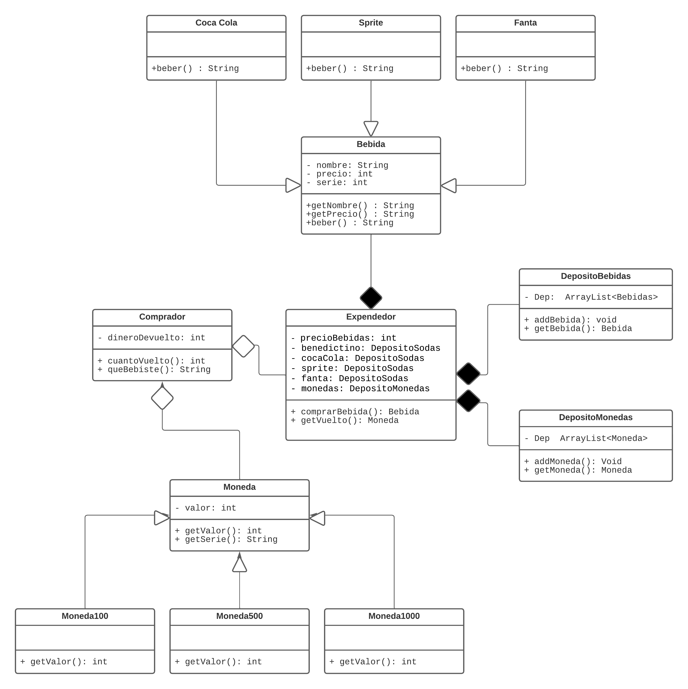
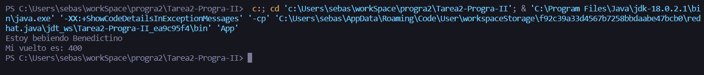

# Tarea 2 - Programación II

> ([Informática UdeC](https://fi.udec.cl/pregrado/ingenieria-civil-informatica/) 2022-2)

## Texto a UML y Uso de Git

El trabajo consiste en crear un expendedor de bebidas, que cuente con una entrada para:
- Monedas
- Selector numérico para elegir tipo de Bebida y un retorno de Bebida

### Integrantes
- [Sebastián Benjamín Bustos Beni](https://github.com/sebasinmas)
- [Carlos Efraín Pinto Urtubia](https://github.com/CxrlosKenobi)

---
### Estructura de proyecto

El espacio de trabajo desarrollado bajo el ambiente de [Java Maven](https://marketplace.visualstudio.com/items?itemName=vscjava.vscode-maven) para [VSCode](https://code.visualstudio.com/) contiene las siguientes carpetas, donde:
- `src`: la carpeta para mantener el código fuente de la tarea.
- `assets`: la carpeta para mantener archivos que brindan contexto al repo.

Mientras que la sub carpeta `src.packages` contiene el siguiente árbol de carpetas nombradas semánticamente conteniendo:

- `coins`: Implementación de clases relacionadas con la clase abstraca moneda y sus extensiones.
- `sodas`: Implementación de clases relacionadas con la clase asbtracta Bebida.
    - `flavours`: Sub carpeta de `sodas` conteniendo distintas bebidas.
- `vendingMachine`: Implementación de la máquina expendedora.
    - `storages`: Sub carpeta de `vendingMachine` con clases relacionadas a los depósitos de la máquina expendedora.


### Diagrama UML

El diagrama UML base de la tarea se encuentra en la carpeta `/assets` junto al enunciado de la tarea.



---

### Ejemplo de uso

El siguiente ejemplo muestra la instanciación de la clase `Comprador` que manipula a través del construcor la máquina expendedora de la clase `Expendedor`.

```java
    public static void main(String[] args) {
        int numBebidas = 5, precioBebidas = 500;
        Expendedor vendomatic = new Expendedor(numBebidas, precioBebidas);

        int tipoBebida = 0;
        Moneda moneda = new Moneda1000();

        Comprador JeanPierre = new Comprador(moneda, tipoBebida, vendomatic);
    }

```
### Ejemplo de salida


### Excepciones

- `NoHayBebidaException`: Se lanza cuando no hay bebida en el dispensador, devolviendo el dinero.

- `PagoInsuficienteException`: Se lanza cuando el pago es insuficiente, devolviendo el dinero.

- `PagoIncorrectoException`: Se lanza cuando no hay pago, o es `null`, no retorna vuelto, ni bebida.


### Opciones de bebidas

- `0`: `Benedictino [350cc]`
- `1`: `Coca Cola [350cc]`
- `2`: `Fanta [350cc]`
- `3`: `Sprite [350cc]`

